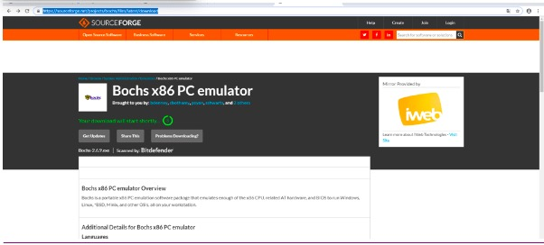
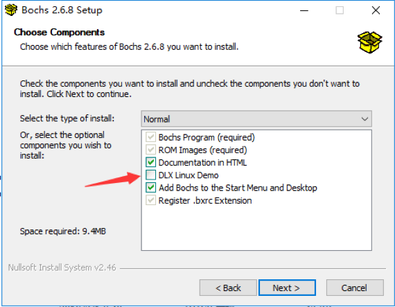
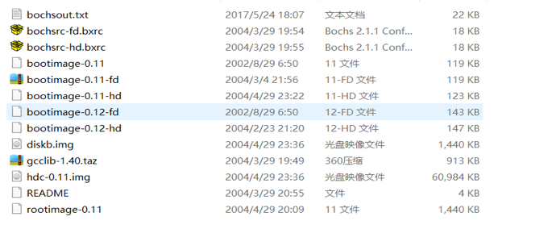
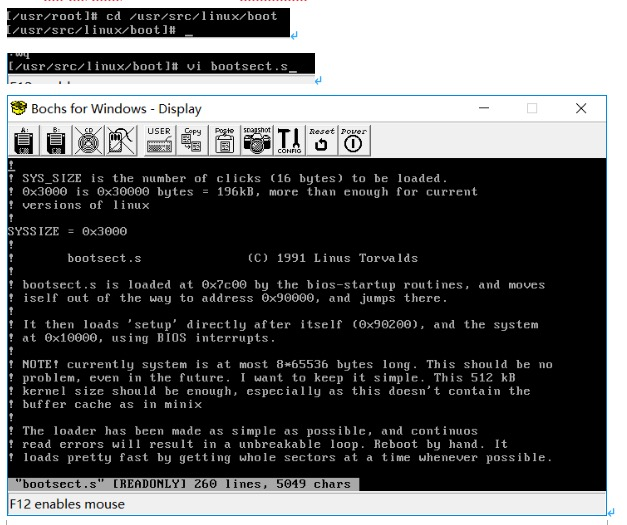
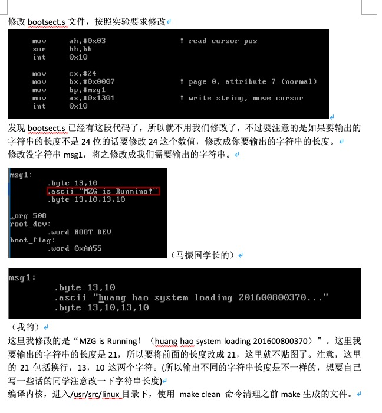
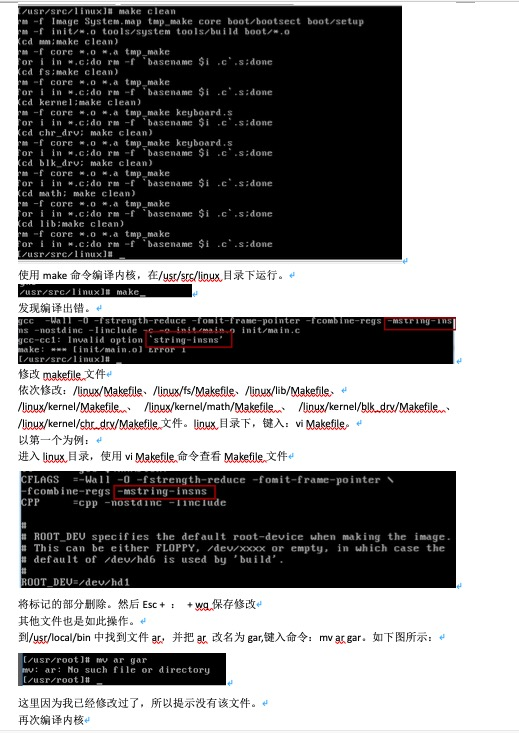
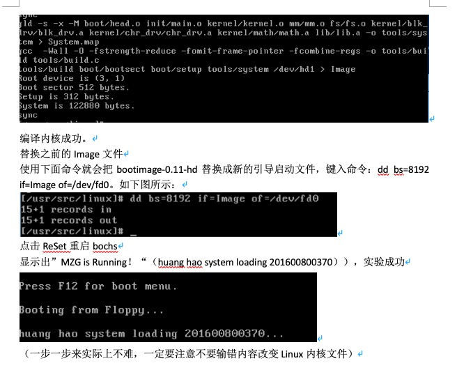
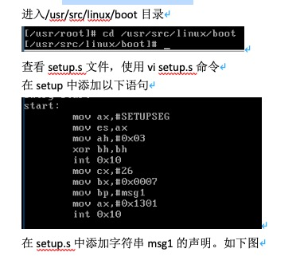
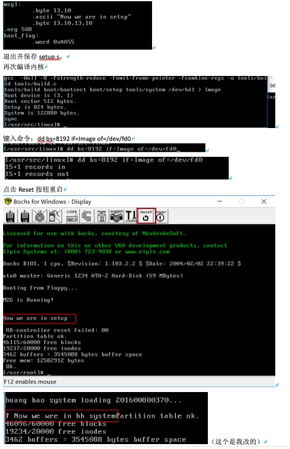

# 操作系统课程设计实验一

## 一、配置环境

>下载Bochs，链接 <https://sourceforge.net/projects/bochs/files/latest/download>
（需要科学上网）

安装Bochs,安装的时候一定要点击linux demo（如果点击之后，后续可以直接拖拽Linux 0.11正确文件直接运行）

下载Linux 0.11的系统包并解压。：
<http://oldlinux.org/Linux.old/bochs/linux-0.11-devel-040329.zip>

将上面的文件复制到bochs安装目录并替换。
在bochs安装目录打开bochsrc-hd.bxrc。（自己进行到此步的同学是会运行错误的，请使用我配置好的文件，有一些引用关系需要更改）
安装完毕，~~为了方便学弟学妹们安装，我将配置正确的资源文件夹放在该实验目录下。（但是实验一已经做完了，如果希望重做请重新搭建环境）~~

> 后来补充，建议直接使用实验楼的环境，自己搭总有各种问题很头疼。

## 二、完成bootsect.s的屏幕输出功能

这里感谢马振国学长的实验报告，学长的实验报告已经很详细了，一步步跟下来别打错基本没有问题，同时Linux0.11的vi很不友好，同学可以去看一下vi的一些快捷使用方式，这样有利于提高实验速度，据说每一个LInuxer都把vi玩的66的

进入/usr/src/linux/boot目录，打开bootsect.s文件

## 三、修改setup.s

>打印出”Now we are in hh system“提示信息
