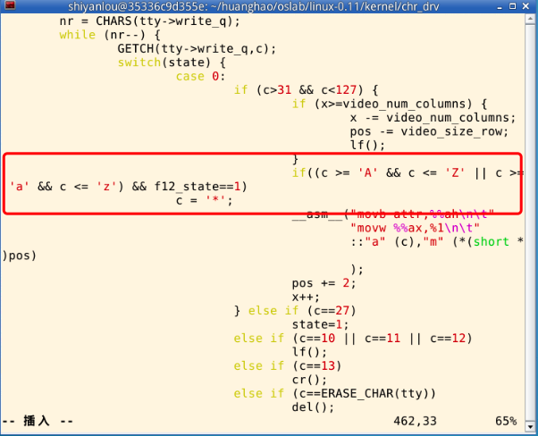
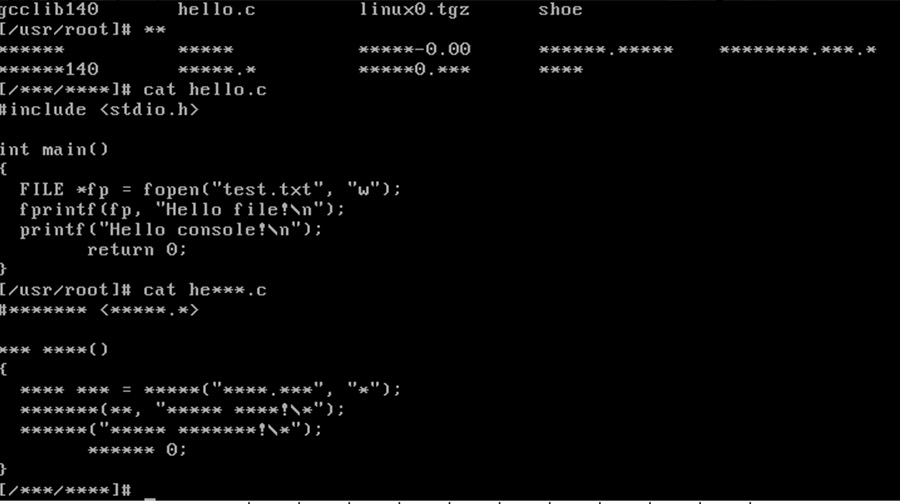

# 操作系统课程设计实验七

>写在前面：~~终于到了实验又变得比较简单了，好开心~~

## 一、实验目的

---

+ 加深对操作系统设备管理基本原理的认识，实践键盘中断、扫描码等概念
+ 通过实践掌握Linux 0.11对键盘终端和显示器终端的处理过程。

## 二、实验内容

---

 请参考实验楼<https://www.shiyanlou.com/courses/115/labs/574/document/>

## 三、实验步骤

> 我参考了一些博客，各不一样，主要依据这一篇来做<https://blog.csdn.net/ccshijtgc/article/details/60756423>

---

### 1、定义一个 int 类型变量并实现weitch_f12

include/linux/sched.h

>int f12_state;

kernel/sched.c 实现函数

``` c
f12_state = 0; //初始时正常显示
void switch_f12(void)
{
    if (f12_state == 1)
        f12_state = 0;
    else
        f12_state = 1;
}

```

### 2、终端显示字符修改

kernel/chr_drv/console.c 中的 con_write 函数



修改 kernel/chr_drv/keyboard.S

```  assemble
func:

    cmpb $0x58,%al /* 判断是否 F12 键 */
    jne continue_func /* 不是则照常执行 */
    pushl %eax
    pushl %ecx
    pushl %edx
    call switch_f12 /* 切换状态 */
    popl %edx
    popl %ecx
    popl %eax
    jmp end_func /* 不再执行其他操作 */
continue_func:

    pushl %eax
    pushl %ecx
    pushl %edx
    call show_stat
    ...
```

### 3、结果



## 四、参考资料

<https://blog.csdn.net/ccshijtgc/article/details/60756423>
<http://www.zhimengzhe.com/linux/190647.html>
<https://blog.csdn.net/wangyi_lin/article/details/7028811>
<https://blog.csdn.net/m0_38099380/article/details/89221596>这个也很简单，实现思路不太一样，有兴趣的可以试一试