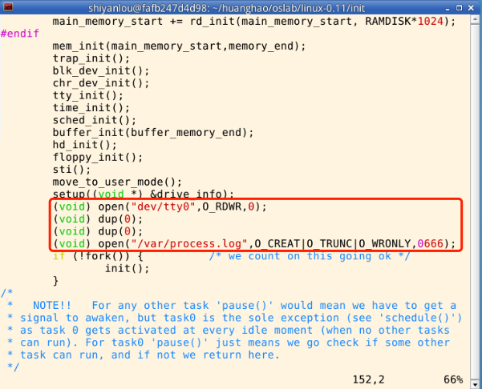
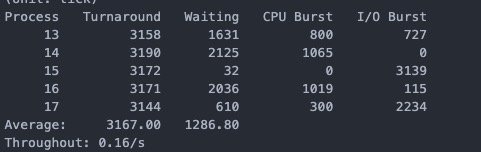

# 操作系统课程设计实验三

>进程运行轨迹的跟踪与统计

> 写在前面：本来以为第二个实验挺难的了（主要在环境），第三个实验没想到真正难度突然就上去了，目前只是实现了该实验，对于实验的大致思路有了一定的了解，但是对于细节还是有很多不懂的地方，需要继续回顾。


## 一、实验目的

+ 掌握Linux下的多进程编程技术；
+ 通过对进程运行轨迹的跟踪来形象化进程的概念；
+ 在进程运行轨迹跟踪的基础上进行相应的数据统计，从而能对进程调度算法进行实际的量化评价，更进一步加深对调度和调度算法的理解，获得能在实际操作系统上对调度算法进行实验数据对比的直接经验。

## 二、实验内容

请参考HIT李治军老师的实验指导手册
（太多了 不好摘过来 放一个实验楼的手册<a href="https://www.shiyanlou.com/courses/115/labs/570/document/">地址</a>）

## 三、实验相关参考资料

**本节单独开了这个部分，因为有一些关于进程并行之类的编码对我来说是一脸懵**

+ <a href="https://blog.csdn.net/LYhani82475/article/details/79867456">linux进程和线程，以及fork、wait、waitpid函数简单介绍</a>

+ <a href="https://blog.csdn.net/qq_43706089/article/details/87980104">多任务编程-fork()和waitpid()函数</a> 这个是实战，我底层编程比较菜，就直接用了大佬写好的。

最好还是看一下有关进程状态的一些资料，对这个实验比较有用，但是也比较耗费时间。

## 四、实验步骤

> 实验步骤很多代码自己确实写不出来，参考的比较多，我会将参考的博客列在实验报告的最后面，感谢HIT的各位同学的无私奉献。

### 1、修改main.c，让系统启动的时候创建process.log

修改文件路径： linux-0.11/init/main.c


代码如下，cv大法好,图片少框了一行，注意注意。

```
setup((void *) &drive_info);
(void) open("/dev/tty0",O_RDWR,0);    //建立文件描述符0和/dev/tty0的关联
(void) dup(0);        //文件描述符1也和/dev/tty0关联
(void) dup(0);        //文件描述符2也和/dev/tty0关联
(void) open("/var/process.log",O_CREAT|O_TRUNC|O_WRONLY,0666);
```

### 2.编写fprintk.c 文件 && 修改Makefile文件

路径：linux-0.11/kernel/fprintk.c
<br>
作用：写日志啊，写成一个函数方便调用。

代码如下

```
#include "stdarg.h"
#include "linux/sched.h"
#include "sys/stat.h"

static char logbuf[1024];
int fprintk(int fd, const char *fmt, ...)
{
    va_list args;
    int count;
    struct file * file;
    struct m_inode * inode;

    va_start(args, fmt);
    count=vsprintf(logbuf, fmt, args);
    va_end(args);

    if (fd < 3)    /* 如果输出到stdout或stderr，直接调用sys_write即可 */
    {
        __asm__("push %%fs\n\t"
            "push %%ds\n\t"
            "pop %%fs\n\t"
            "pushl %0\n\t"
            "pushl $logbuf\n\t" /* 注意对于Windows环境来说，是_logbuf,下同 */
            "pushl %1\n\t"
            "call sys_write\n\t" /* 注意对于Windows环境来说，是_sys_write,下同 */
            "addl $8,%%esp\n\t"
            "popl %0\n\t"
            "pop %%fs"
            ::"r" (count),"r" (fd):"ax","cx","dx");
    }
    else    /* 假定>=3的描述符都与文件关联。事实上，还存在很多其它情况，这里并没有考虑。*/
    {
        if (!(file=task[0]->filp[fd]))    /* 从进程0的文件描述符表中得到文件句柄 */
            return 0;
        inode=file->f_inode;

        __asm__("push %%fs\n\t"
            "push %%ds\n\t"
            "pop %%fs\n\t"
            "pushl %0\n\t"
            "pushl $logbuf\n\t"
            "pushl %1\n\t"
            "pushl %2\n\t"
            "call file_write\n\t"
            "addl $12,%%esp\n\t"
            "popl %0\n\t"
            "pop %%fs"
            ::"r" (count),"r" (file),"r" (inode):"ax","cx","dx");
    }
    return count;
}
```

修改Makefile文件的地点如下所示：

这个比较少，就不放代码了，手改一下就行，注意别改错了。
改完可以编译一下看看有没有改错，编译直接make all 就可以了。

### 3.修改三大.c文件
这里就开始比较吃力了，我直接放一下路径和代码，这个地方我自己也需要再理解一下，不敢乱说，但是总到应该就是让进程在状态变换的时候进行记录。
<br>
kernel/fork.c:
```
...
	p->utime = p->stime = 0;
	p->cutime = p->cstime = 0;
	p->start_time = jiffies;
	fprintk(3,"%ld\t%c\t%ld\n",last_pid,'N',jiffies); 
	p->tss.back_link = 0;
	p->tss.esp0 = PAGE_SIZE + (long) p;
	p->tss.ss0 = 0x10;
	p->tss.eip = eip;
...
 
...
set_tss_desc(gdt+(nr<<1)+FIRST_TSS_ENTRY,&(p->tss));
	set_ldt_desc(gdt+(nr<<1)+FIRST_LDT_ENTRY,&(p->ldt));
	p->state = TASK_RUNNING;	/* do this last, just in case */
	fprintk(3,"%ld\t%c\t%ld\n",last_pid,'J',jiffies);
	return last_pid;
}
...
```
kernel/sched.c：
```
...
void schedule(void)
{
	int i,next,c;
	struct task_struct ** p;
 
/* check alarm, wake up any interruptible tasks that have got a signal */
 
	for(p = &LAST_TASK ; p > &FIRST_TASK ; --p)
		if (*p) {
			if ((*p)->alarm && (*p)->alarm < jiffies) {
					(*p)->signal |= (1<<(SIGALRM-1));
					(*p)->alarm = 0;
				}
			if (((*p)->signal & ~(_BLOCKABLE & (*p)->blocked)) &&
			(*p)->state==TASK_INTERRUPTIBLE)
			{
				(*p)->state=TASK_RUNNING;
				 fprintk(3,"%ld\t%c\t%ld\n",(*p)->pid,'J',jiffies);
			}
		}
...
 
...
			if ((*p)->state == TASK_RUNNING && (*p)->counter > c)
				c = (*p)->counter, next = i;
		}
		if (c) break;
		for(p = &LAST_TASK ; p > &FIRST_TASK ; --p)
			if (*p)
				(*p)->counter = ((*p)->counter >> 1) +
						(*p)->priority;
	}
	if(current->state == TASK_RUNNING && current != task[next])   
	{
        /*输出就绪的Log*/  
         fprintk(3,"%ld\t%c\t%ld\n",current->pid,'J',jiffies);   
    }
     if(current != task[next])   
     {
         /*输出可运行的Log*/  
         fprintk(3,"%ld\t%c\t%ld\n",task[next]->pid,'R',jiffies);  
     }
	switch_to(next);
}
...
 
 
...
int sys_pause(void)
{
	current->state = TASK_INTERRUPTIBLE;
	if (current->pid != 0)       
         fprintk(3,"%ld\t%c\t%ld\n",current->pid,'W',jiffies); 
	schedule();
	return 0;
}
...
 
 
...
void sleep_on(struct task_struct **p)
{
	struct task_struct *tmp;
 
	if (!p)
		return;
	if (current == &(init_task.task))
		panic("task[0] trying to sleep");
	tmp = *p;
	*p = current;
	current->state = TASK_UNINTERRUPTIBLE;
	if (current->pid != 0)   
       fprintk(3,"%ld\t%c\t%ld\n",current->pid,'W',jiffies); 
	schedule();
	if (tmp)
		tmp->state=0;
}
...
 
 
...
void interruptible_sleep_on(struct task_struct **p)
{
	struct task_struct *tmp;
 
	if (!p)
		return;
	if (current == &(init_task.task))
		panic("task[0] trying to sleep");
	tmp=*p;
	*p=current;
repeat:	current->state = TASK_INTERRUPTIBLE;
	if (current->pid != 0)   
		 fprintk(3,"%ld\t%c\t%ld\n",current->pid,'W',jiffies); 
	schedule();
	if (*p && *p != current) {
		(**p).state=0;
		fprintk(3,"%ld\t%c\t%ld\n",(**p).pid,'J',jiffies); 
		goto repeat;
	}
	*p=NULL;
	if (tmp)
	{
		tmp->state=0;
		fprintk(3,"%ld\t%c\t%ld\n",tmp->pid,'J',jiffies);
	}
}
...
 
 
...
void wake_up(struct task_struct **p)
{
	if (p && *p) {
		if((**p).state != TASK_RUNNING)
		{   
              fprintk(3,"%ld\t%c\t%ld\n",(**p).pid,'J',jiffies);   
              (**p).state=TASK_RUNNING;  
		}
	}
}
...
```

kernel/exit.c:
```
...
			case TASK_ZOMBIE:
				current->cutime += (*p)->utime;
				current->cstime += (*p)->stime;
				flag = (*p)->pid;
				code = (*p)->exit_code;
				fprintk(3,"%ld\t%c\t%ld\n",flag,'E',jiffies);
				release(*p);
				put_fs_long(code,stat_addr);
				return flag;
			default:
				flag=1;
				continue;
		}
	}
	if (flag) {
		if (options & WNOHANG)
			return 0;
		current->state=TASK_INTERRUPTIBLE;
		if (current->pid!=0)
		{  
			fprintk(3,"%ld\t%c\t%ld\n",current->pid,'W',jiffies);
		}
		schedule();
		if (!(current->signal &= ~(1<<(SIGCHLD-1))))
			goto repeat;
...
```
仔仔细细改完之后实验就快做完了！

### 4.将process.c stat_log.py放到hdc/var

这两个文件都可以在/teacher/目录下找到，放完之后推出hdc
>sudo umount hdc

### 5.在bochs里面编译process.c 然后运行 

编译的命令是
>gcc -o process process.c

运行的是
>./process

注意看一下/var/目录下有没有process.log文件，如果没有的话，重新载入hdc，然后去linux-0.11目录下进行 
>make all

>make -j 2

>make all

基本上就大功告成，如果还是不行的话，请自己找原因。

### 6.看结果
运行python文件就可以看结果了，运行的时候给python文件加一个权限。
路径在hdc/var/
>chmod 777 stat_log.py

运行python文件
>./stat_log.py process.log 0 1 2 3 4 5 -g

结果如下



## 五、参考资料&&致谢

参考的博客如下：

---

https://blog.csdn.net/yuebowhu/article/details/78818171
https://www.jianshu.com/p/b32dc6e1cf63
https://www.cnblogs.com/XiangfeiAi/p/4751228.html
https://www.cnblogs.com/SnakeHunt2012/archive/2013/02/13/2911096.html

致谢：

---

感谢大家的分享，没有这些资料的参考，是做不出来结果的。


（最后说一下，实验结果的图是从第二个博客摘的，我自己的......一直显示重复，可能是改文件的时候不小心改多了）

