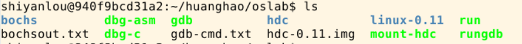
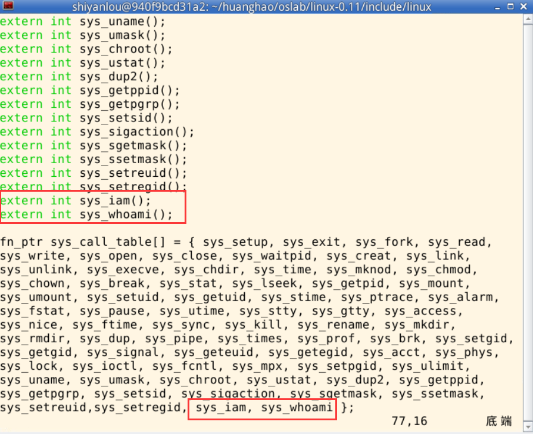
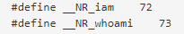
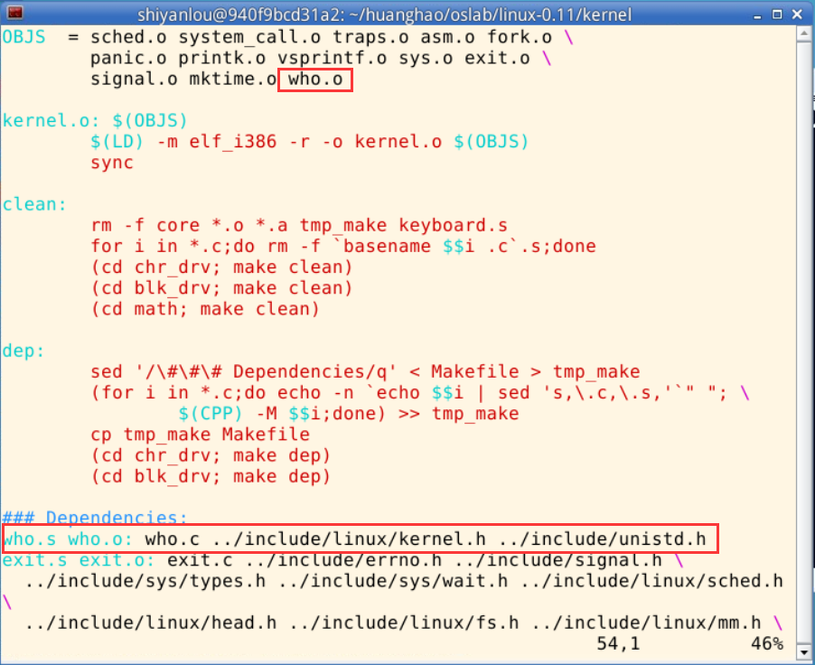
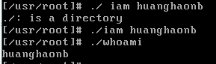

# 操作系统课程设计实验二


写在前面：

---

这个实验做的时间很久很久，建议老师不要使用Windows下的bochs作为实验环境，太多bug了，有些是因为低版本的c++编译器并不好用，
有些是因为vi写程序很容易出错而且又不好改，在这里强烈推荐一个平台，<a href="https://www.shiyanlou.com/courses/115">实验楼
</a>，操作系统课程设计这门课是免费课程，直接通过浏览器ssh过去。
对比目前Windows下的bochs的环境有以下好处：
1. 减少无意义的时间浪费，例如低版本vi编辑器的恶心操作。利用ubantu做background启动bochs可以直接挂载和退出，这样可以使用
高版本的vi对文件进行编辑（好歹可以复制粘贴和delete删除，esc之后x再删除真的好痛苦）
2. 环境是哈工大os实验环境，直接解压安装即可，没有那么多问题。
3. 边讲边练，比较好，教程也有，比FTP提供的新一些，但是还是不够，特别参数互传调用的时候需要用到很多其他的东西，这些还是
需要自己找。
<br>

但是也有如下坏处：
1. 不能保存环境（土豪除外，会员一年好像三百多），好在实验之间依赖性不大。
2. 可能死机，几率比较小，但是遇到之后心态可能蹦。


>本实验报告依据实验楼环境进行编写，如有问题可以联系我qq 812116298 进行交流。

## 一、实验目的
在Linux 0.11环境上添加两个系统调用，并且实现参数传递。
第一个系统调用是**iam()**，其原型为：
**int iam(const char * name)**; 完成的功能是将字符串参数name的内容拷贝到内核中保存下来。要求name的长度不能超过23个字符。
返回值是拷贝的字符数。如果name的字符个数超过了23，则返回“-1”，并置errno为EINVAL。
在kernal/who.c中实现此系统调用。


第二个系统调用是**whoami()**，其原型为：
**int whoami(char * name, unsigned int size)**; 它将内核中由iam()保存的名字拷贝到name指向的用户地址空间中，
同时确保不会对name越界访存（name的大小由size说明）。返回值是拷贝的字符数。如果size小于需要的空间，则返回“-1”，
并置errno为EINVAL。
也是在kernal/who.c中实现。

##二、实验步骤
###1、解压
/home/shiyanlou/oslab 目录下有完整的实验环境，在外层目录下建立自己的目录，然后cp过去，进行解压。
uabntu下解压的命令是 
`
 tar -zxvf *.tar.gz
`

###2、编译系统
这个环境是比较原始的，需要对系统进行编译才能使用bochs进行调用，编译的过程实验楼已经说的比较清楚了，这里直接摘过来。
> “编译内核”比“编写内核”要简单得多。首先要进入linux-0.11目录，然后执行：

> $ make all

> 因为“all”是最常用的参数，所以可以省略，只用“make”，效果一样。

> 在多处理器的系统上，可以用-j参数进行并行编译，加快速度。例如双CPU的系统可以：

>$ make -j 2

>make命令会显示很多很多很多的信息，你可以尽量去看懂，也可以装作没看见。只要最后几行中没有“error”就说明编译成功。最后生成的目标文件是一个软盘镜像文件——linux-0.11/Image。如果将此镜像文件写到一张1.44MB的软盘上，就可以启动一台真正的计算机。

>linux-0.11目录下是全部的源代码，很多实验内容都是要靠修改这些代码来完成。修改后需要重新编译内核，还是执行命令：

>$ make all

>make命令会自动跳过未被修改的文件，链接时直接使用上次编译生成的目标文件，从而节约编译时间。但如果重新编译后，你的修改貌似没有生效，可以试试先“make clean”，再“make all”。“make clean”是删除上一次编译生成的所有中间文件和目标文件，确保是在全新的状态下编译整个工程。

编译完成之后就可以看到这样的目录了，注意修改的大部分文件都在linux-0.11里面，只有少数需要到hdc下面去进行修改，hdc可以理解为虚拟机，用户使用的一些变量，大部分还是修改系统，也就是linux-0.11的。


###3、修改linux-0.11/include/linux/sys.h 

这里开始正式进入编写系统调用的过程了，首先我们对系统调用进行一个声明，其实模仿别的系统调用就可以了。注意，这里是添加
__全局变量和中断函数表__ 。目录看小标题，千万别改错了。


###4、修改系统调用数以及新增系统调用号
一开始系统是72个调用的，现在变成了74个，所以需要改总数。
更改文件的路径是**linux-0.11/kernel/system_call.s**
>一个小技巧 vi下非插入模式可以直接按 /72 回车进行搜索 一键定位


增加系统调用号也比较好理解，我要调用一个系统函数，需要给他一个编号啊，这个要注意下，是改的用户下的，而不是系统的。
换成大白话就是 改hdc下面的，不是改linux0.11里面的。
<br>`sudo ./mount-hdc`
执行了这个命令之后hdc就可以访问了，然后就可以使用高版本的vi舒服的改了。改完之后用
`sudo umount hdc`重新挂在上去。

改这个文件hdc/usr/include/unistd.h（不标路径直接让改的教程对新手是不友好的~）如图所示补上就行

###5、新增who.c文件,实现系统调用的函数
这里具体实现系统调用的函数，讲道理这里实验报告没有，自己写出来的可能性确实不大（巨佬除外）
who.c文件的路径放在 **linux-0.11/kernel/** 下
```
#include <string.h>
#include <errno.h>
#include <asm/segment.h>

char msg[24];

int sys_iam(const char * name)
{
    char tep[26];
    int i = 0;
    for(; i < 26; i++)
    {
        tep[i] = get_fs_byte(name+i);
        if(tep[i] == '\0')  break;
    }

    if (i > 23) return -(EINVAL);

    strcpy(msg, tep);
    return i;
}

int sys_whoami(char * name, unsigned int size)
{
    int len = 0;
    for (;msg[len] != '\0'; len++);
    
    if (len > size) 
    {
        return -(EINVAL);
    }
    
    int i = 0;
    for(i = 0; i < size; i++)
    {
        put_fs_byte(msg[i], name+i);
        if(msg[i] == '\0') break;
    }
    return i;
}
```

###6、修改Makefile 文件
这个修改的作用就是让编译系统的时候也把who.c给一起编译了。回到linux-0.11路径下了。
kernel/Makefile修改这个文件,要改的地方见红色框框。



###7、新增iam.c 跟whoami.c文件以测试是否添加系统调用成功以及编译 iam.c 跟 whoami.c
（吐槽一下，这两个函数也没有给代码，自己写emmmm难度有点大）
两个文件都建在**用户**目录的root文件下，具体方式请参照前面的推出和挂在。代码见下面：
+ iam.c
```
#define __LIBRARY__
#include <unistd.h>
#include <string.h>
#include <errno.h>
#include <stdio.h>
_syscall1(int,iam,const char*,name)

int main(int argc,char* argv[])
{
    iam(argv[1]);
    return 0;
}
```
+ woami.c
```angular2
#define __LIBRARY__
#include <unistd.h>
#include <errno.h>
#include <stdio.h>

_syscall2(int, whoami, char*, name, unsigned int, size);

int main(int argc, char ** argv)
{
    char t[30];
    whoami(t, 30);
    printf("%s\n", t);
    return 0;
}
```
编译请直接 
>gcc -o iam iam.c

>gcc -o whoami whoami.c

（unix哲学 没有结果就是最好的结果）

##三、实验结果
实验楼速度比较快，之前在Windows上做了一天都各种问题，心态爆炸，证明了好的工具也同样重要。
<br>
