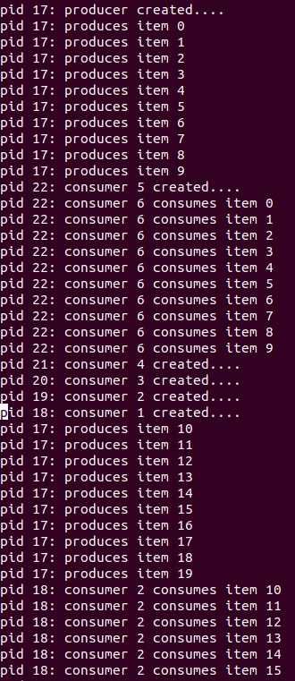

# 操作系统课程设计实验五

## 一、实验目的

+ 加深对进程同步与互斥概念的认识；

+ 掌握信号量的使用，并应用它解决生产者——消费者问题；

+ 掌握信号量的实现原理。


## 二、实验内容

+ 在Ubuntu下编写程序，用信号量解决生产者——消费者问题；

+ 在0.11中实现信号量，用生产者—消费者程序检验之。

## 三、实验步骤

### 1、添加信息量操作的系统调用

这一部分基本在实验二做过的，这里简单写一下改的地方。

修改unistd.h文件，加入系统调用号：

```
#define __NR_sem_open 72
#define __NR_sem_wait 73
#define __NR_sem_post 74
#define __NR_sem_unlink 75
```

修改 system_call.s文件 改写调用数：

```
nr_system_calls = 76
```

修改sys.h文件

```
extern sem_t * sem_open();
extern int sem_wait();
extern int sem_post();
extern int sem_unlink();
......
fn_ptr sys_call_table[] = 
{ sys_setup, sys_exit, sys_fork, sys_read,……, sem_open, sem_wait, sem_post, sem_unlink}，
```

### 2、定义信号量数据结构

修改unistd.h文件

```
...
#endif /* __LIBRARY__ */
extern int errno;

//定义的信号量数据结构:
typedef struct sem_t 
{
	char name[20];//信号量的名称
	int value;    //信号量的值
	struct * tast_struct queue;//指向阻塞队列的指针
}sem_t;

/**
    如果自己实现队列(用if语句实现的时候)，在这里需要定义数据结构
*/

...(原本的系统调用)

sem_t *sem_open(const char * name,unsigned int value);
int sem_wait(sem_t *sem);
int sem_post(sem_t *sem);
int sem_unlink(const char * name);
```

### 3、实现系统调用

在linux-0.11/kernel/下实现sem.c（系统调用）

```
#define __LIBRARY__  
#include <unistd.h>
#include <linux/sched.h>
#include <linux/kernel.h>
#include <asm/segment.h>
#include <asm/system.h>

sem_t *sem_head = &((sem_t *){"\0",0,NULL,NULL});

sem_t *sys_sem_open(const char *name,int value){
        char pname[SEM_NAME_LEN];
        sem_t *sem_cur,*sem_pre;
        //获取用户态字符串
        char c;
        int i;

        for(i=0;(c=get_fs_byte(name++))!='\0' && i<SEM_NAME_LEN;i++)
                pname[i]=c;
        pname[i]='\0';
        //查看是否存在
        for(sem_pre=sem_head,sem_cur=sem_head->next ;sem_cur&&strcmp(pname,sem_cur->name);sem_pre=sem_cur,sem_cur=sem_cur->next)

        //新建一个
        if(!sem_cur){
                printk("semaphore %s no found. created a new one. \n", pname);
                sem_cur = (sem_t *)malloc(sizeof(sem_t));
                strcpy(sem_cur->name,pname);
                sem_cur->value = value;
                sem_cur->next =NULL;
                sem_pre->next = sem_cur;

        }
        printk("pid %d opens semaphore %s(value %u) OK. \n", current->pid, pname, sem_cur->value);
    return sem_cur;
}

int sys_sem_wait(sem_t *sem){
        //关中断
        cli();
        //<=0sLEEP
        while(sem->value<=1)
                sleep_on(&(sem->s_wait));
        //--
        sem->value--;
        //开中断
        sti();
        return 0;
}

int sys_sem_post(sem_t *sem){
        sem->value++;
        if(sem->value>0){
                wake_up(&(sem->s_wait));
                return 0;
        }
        return -1;
}

int sys_sem_unlink(const char *name){
         char pname[SEM_NAME_LEN];
        sem_t *sem_cur,*sem_pre;
        //获取用户态字符串
        char c;
        int i;

        for(i=0;(c=get_fs_byte(name++))!='\0' && i<SEM_NAME_LEN;i++)
                pname[i]=c;
        pname[i]='\0';
        //查看是否存在
        for(sem_pre=sem_head,sem_cur=sem_head->next ;sem_cur&&strcmp(pname,sem_cur->name);sem_pre=sem_cur,sem_cur=sem_cur->next)

        //不存在
        if(!sem_cur)
                return -1;

        //存在
        sem_pre->next = sem_cur->next;
        free(sem_cur);

        printk("unlink semaphore %s OK. \n", pname);
        return 0;


}

```

### 4、修改Makefile

这个地方也是比较常规的修改
```
OBJS  = sched.o system_call.o traps.o asm.o fork.o \
        panic.o printk.o vsprintf.o sys.o exit.o \
        signal.o mktime.o sem.o

......

sem.s sem.o: sem.c ../include/linux/kernel.h ../include/unistd.h
  
```

### 5、编写消费者程序pc.c

```
#include <stdio.h>
#include <stdlib.h>
#define   __LIBRARY__
#include <unistd.h>


_syscall2(sem_t *,sem_open,const char *,name,int,value);
_syscall1(int,sem_wait,sem_t *,sem);
_syscall1(int,sem_post,sem_t *,sem);
_syscall1(int,sem_unlink,const char *,name);

#define CONSUMERS  5
#define PRODUCER 50
#define BUFFSIZE 10  

int item_pro,item_used;
sem_t *empty,*full,*mutex;

int main(){
        int pid;
        int i;
        int fi;
        int fo;
        fi = open("buff.dat",O_CREAT|O_TRUNC|O_WRONLY,0222);
        fo = open("buff.dat",O_TRUNC|O_RDONLY,0444);
        mutex = sem_open("mutex",1);
        full = sem_open("full",0);
        empty = sem_open("empty",BUFFSIZE);


        if((pid=fork()))
        {
                printf("pid %d:\tproducer created....\n", pid);
                fflush(stdout);
                while(item_pro<=PRODUCER){
                        printf("debug1\n");
                        sem_wait(empty);
                        printf("debug2\n");
                        sem_wait(mutex);
                        printf("debug3\n");
                        if(!(item_pro % BUFFSIZE))
                        lseek(fi, 0, 0);

                        write(fi, (char *) &item_pro, sizeof(item_pro));        /* 写入产品编号 */
                        printf("pid %d:\tproduces item %d\n", pid, item_pro);
                        fflush(stdout);
                        item_pro++;
                        sem_post(mutex);
                        sem_post(full);
                }

        }else{
                i = CONSUMERS;
                while(i--){
                        if((pid=fork())==0){
                                pid = getpid();
                                printf("pid %d:\tconsumer %d created....\n", pid, CONSUMERS-i);
                                fflush(stdout);
                                while(1){
                                        sem_wait(full);
                                        sem_wait(mutex);
/*read()读到文件末尾时返回0，将文件的位置指针重新定位到文件首部 */
                                         if(!read(fo, (char *)&item_used, sizeof(item_used)))
                                        {
                                                lseek(fo, 0, 0);
                                                read(fo, (char *)&item_used, sizeof(item_used));
                                        }

                                        printf("pid %d:\tconsumer %d consumes item %d\n", pid, CONSUMERS-i+1, item_used);
                                        fflush(stdout);
                                        sem_post(mutex);
                                        sem_post(empty);
                                        if(item_used==PRODUCER)
                                                goto OK;


                                }

                        }

                }


        }

OK:
        sem_unlink("empty");
        sem_unlink("full");
        sem_unlink("mutex");
        close(fi);
        close(fo);
        return 0;


}


```

## 四、实验结果



（实验楼在最后一步，实验结果来自他人ubuntu下实验结果）

## 五、参考资料

https://www.shiyanlou.com/courses/115/labs/572/document/

https://blog.csdn.net/u013129143/article/details/83755904

https://blog.csdn.net/qq_41708792/article/details/89637360