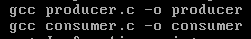

# 操作系统课程设计实验六

## 一、实验目的

+ 深入理解操作系统的段、页式内存管理，深入理解段表、页表、逻辑地址、线性地址、物理地址等概念；

+ 实践段、页式内存管理的地址映射过程；

+ 编程实现段、页式内存管理上的内存共享，从而深入理解操作系统的内存管理。

## 二、实验内容

1.用Bochs调试工具跟踪Linux 0.11的地址翻译(地址映射)过程,了解IA-32和Linux 0.11的内存理机制。

2.在Ubuntu上编写多进程的生产者—消费者程序,用共享内存做缓冲。

3.在信号量实验的基础上,为Linux 0.11增加共享内存功能，并将生产者—消费者程序移植到Linux 0.11。

## 三、实验步骤

### 1、编写view-memory.c文件并且使用bochs跟踪地址翻译

> view-memory.c文件

``` c++
#include <stdio.h>
int i = 0x12345678;
int main(void)
{
    printf("The logic or virtual address of i is 0x%08x\n", &i);
    while(i);
    return 0;
}

```

>跟踪过程

``` text
//=====================================================================================


========================================================================
                       Bochs x86 Emulator 2.3.7
               Build from CVS snapshot, on June 3, 2008
========================================================================
00000000000i[     ] reading configuration from ./bochs/bochsrc.bxrc
00000000000i[     ] installing x module as the Bochs GUI
00000000000i[     ] using log file ./bochsout.txt
Next at t=0
(0) [0xfffffff0] f000:fff0 (unk. ctxt): jmp far f000:e05b         ; ea5be000f0
<bochs:1> c
^CNext at t=121516790
(0) [0x00faa06c] 000f:0000006c (unk. ctxt): jmp .+0xfffffff5 (0x10000063) ; ebf5
<bochs:2> n
Next at t=121516791
(0) [0x00faa063] 000f:00000063 (unk. ctxt): cmp dword ptr ds:0x3004, 0x00000000 ; 833d0430000000
<bochs:3> u /7
10000063: (                    ): cmp dword ptr ds:0x3004, 0x00000000 ; 833d0430000000
1000006a: (                    ): jz .+0x00000004           ; 7404
1000006c: (                    ): jmp .+0xfffffff5          ; ebf5
1000006e: (                    ): add byte ptr ds:[eax], al ; 0000
10000070: (                    ): xor eax, eax              ; 31c0
10000072: (                    ): jmp .+0x00000000          ; eb00
10000074: (                    ): leave                     ; c9
<bochs:4> sreg   
cs:s=0x000f, dl=0x00000002, dh=0x10c0fa00, valid=1
ds:s=0x0017, dl=0x00003fff, dh=0x10c0f300, valid=3
ss:s=0x0017, dl=0x00003fff, dh=0x10c0f300, valid=1
es:s=0x0017, dl=0x00003fff, dh=0x10c0f300, valid=1
fs:s=0x0017, dl=0x00003fff, dh=0x10c0f300, valid=1
gs:s=0x0017, dl=0x00003fff, dh=0x10c0f300, valid=1
ldtr:s=0x0068, dl=0x52d00068, dh=0x000082fd, valid=1
tr:s=0x0060, dl=0x52e80068, dh=0x00008bfd, valid=1
gdtr:base=0x00005cb8, limit=0x7ff
idtr:base=0x000054b8, limit=0x7ff
<bochs:5> xp /2w 0x00005cb8 +13*8
[bochs]:
0x00005d20 <bogus+       0>:0x52d000680x000082fd
<bochs:6> xp /8w 0x0052d0fd
[bochs]:
0x0052d0fd <bogus+       0>:0x000000000x000000000x000000000x00000000
0x0052d10d <bogus+      16>:0x000000000x000000000x000000000x00000000
<bochs:7> xp /8w 0x00fd52d0
[bochs]:
0x00fd52d0 <bogus+       0>:0x000000000x000000000x000000020x10c0fa00
0x00fd52e0 <bogus+      16>:0x00003fff0x10c0f3000x000000000x00fd6000
<bochs:8> calc ds:0x3004
0x10003004 268447748
<bochs:9> creg
CR0=0x8000001b: PG cd nw ac wp ne ET TS em MP PE
CR2=page fault laddr=0x10002fac
CR3=0x00000000
    PCD=page-level cache disable=0
    PWT=page-level writes transparent=0
CR4=0x00000000: osxmmexcpt osfxsr pce pge mce pae pse de tsd pvi vme
<bochs:10> xp /68w 0
[bochs]:
0x00000000 <bogus+       0>:0x000010270x000020070x000030070x00004027
0x00000010 <bogus+      16>:0x000000000x0002ace40x000000000x00000000
0x00000020 <bogus+      32>:0x000000000x000000000x000000000x00000000
0x00000030 <bogus+      48>:0x000000000x000000000x000000000x00000000
0x00000040 <bogus+      64>:0x00ffe0270x000000000x000000000x00000000
0x00000050 <bogus+      80>:0x000000000x000000000x000000000x00000000
0x00000060 <bogus+      96>:0x000000000x000000000x000000000x00000000
0x00000070 <bogus+     112>:0x000000000x000000000x000000000x00000000
0x00000080 <bogus+     128>:0x00ff30270x000000000x000000000x00000000
0x00000090 <bogus+     144>:0x000000000x000000000x000000000x00000000
0x000000a0 <bogus+     160>:0x000000000x000000000x000000000x00000000
0x000000b0 <bogus+     176>:0x000000000x000000000x000000000x00ffb027
0x000000c0 <bogus+     192>:0x00ff60270x000000000x000000000x00000000
0x000000d0 <bogus+     208>:0x000000000x000000000x000000000x00000000
0x000000e0 <bogus+     224>:0x000000000x000000000x000000000x00000000
0x000000f0 <bogus+     240>:0x000000000x000000000x000000000x00ffa027
0x00000100 <bogus+     256>:0x00fa70270x000000000x000000000x00000000
<bochs:11> xp /w 0+64*4
[bochs]:
0x00000100 <bogus+       0>:0x00fa7027
<bochs:12> page 0x10003004
linear page 0x10003000 maps to physical page 0x00fa6000
<bochs:13> xp /w 0x00fa6004
[bochs]:
0x00fa6004 <bogus+       0>:0x12345678
END
```

这个计算过程和跟踪过程真的不太会，主要参考了这几篇博客，因为参考的比较多，所以在这个小节的下面直接写出参考的博客来源。

><https://blog.csdn.net/u013129143/article/details/83932146> 这篇说了很多原理

><https://blog.csdn.net/m0_38099380/article/details/89042285>

><https://blog.csdn.net/ccshijtgc/article/details/60605573>

### 2、编写shm.c文件实现shmget和shmat系统调用

shm.c文件代码如下

``` c

// linux-0.11/mm/shm.c
#include <linux/mm.h>
#include <linux/sched.h>
#include <errno.h>

#define COUNT (10)
#define SIZE_MAX  (4096)
unsigned long share_physical_address[COUNT] = {0};

/* create or open a page of the share memroy */
int sys_shmget(int key, size_t size, int shmflg)
{
	// forbid it that more than 4K size
	if (key < 0 || key >= COUNT || size > SIZE_MAX)
	{
		errno = EINVAL; 
		return -1;
	}

	// allocate a page of the free page from the physical memroy
	if (0 == share_physical_address[key])
	{
		share_physical_address[key] = get_free_page();
		if (0 == share_physical_address[key])
		{
			errno = EINVAL; 
			return -1;
		}
	}
	printk("sys_shmget: address = %d\n", share_physical_address[key]);
	return share_physical_address[key];
}

/* get logic address of the memory address */
int sys_shmat(int shmid, const void *shmaddr, int shmflg)
{
	unsigned long data_base = 0; 
	unsigned long data_limit = 0; 
	if (shmid == -1)
	{
		errno = EINVAL;
		return 0;
	}
	
	// establish a mapping between the physical page and the current virtual breakpoint 
	put_page(shmid, (current->start_code + current->brk));
	
	printk("sys_shmat: current->brk = %d\n", current->brk);

	return current->brk;
}
```

同时，这个是要添加系统调用的，需要修改几个文件，忘记的可以参考
[操作系统课程设计实验二](https://github.com/Huaxingweichen/HIT-OS-REPORT/blob/master/%E6%93%8D%E4%BD%9C%E7%B3%BB%E7%BB%9F%E8%AF%BE%E7%A8%8B%E8%AE%BE%E8%AE%A1%E5%AE%9E%E9%AA%8C%E4%BA%8C.md).这里限于篇幅就不一一改了。

### 3、添加sem.c信号量系统调用文件

> 这个文件我也自己写不出来，参考博客会在最后列出

``` c

// linux-0.11/kernel/sem.c
#include <linux/sched.h>
#include <linux/kernel.h>
#include <asm/system.h>
#include <asm/segment.h>
#include <string.h>
#include <stdarg.h>

#define MAX_NAME_LEN  (32)
#define MAX_SEM_NUM  (64)

struct sem_s {
	char  name[MAX_NAME_LEN];
	int max_value;
	int value;
	struct task_struct	*b_wait;
	int enable;
};
typedef struct sem_s sem_t;


struct sem_list_info {
    sem_t *sem_list[MAX_SEM_NUM];
	int index;
};

struct sem_list_info sem_info = {0};

static void get_fs_buff(const char *name, char*buff, int size)
{
	int i;
	memset(buff, 0, size);
	for (i = 0; i < size; i++)
	{
		buff[i] = get_fs_byte(name++);
		if (buff[i] == '\0')
		{
			break;
		}
	}
}

static int find_sem(const char *name, char *buf)
{
	int i = 0;
	get_fs_buff(name, buf, 1024);
	for (i = 0; i < MAX_SEM_NUM; i++)
	{
		if (!sem_info.sem_list[i])
		{
			continue;
		}
		printk("find_sem: sem_info.sem_list[i]->name = %s\n", sem_info.sem_list[i]->name);
		if (0 == strcmp(sem_info.sem_list[i]->name, buf))
		{
			printk("find_sem: buf = %s\n", buf);
			return i;
		}
	}
	return -1;
}


int sys_sem_open(const char *name, unsigned int value)
{
	sem_t *sem = 0;
	int i = 0;
	char buf[1024] = {0};
	int index = find_sem(name, buf);
	printk("sys_sem_open: %s\n", buf);
	cli();
	if (-1 == index)  // new sem, need create it
	{
		for (i = 0; i < MAX_SEM_NUM; i++)
		{
			if (!sem_info.sem_list[i])
			{
				sem_info.sem_list[i] = malloc(sizeof(sem_t)); 
				sem_info.sem_list[i]->max_value = value;
				sem_info.sem_list[i]->value = value;
				sem_info.sem_list[i]->enable = 1;
				strcpy(sem_info.sem_list[i]->name, buf);
				printk("sys_sem_open: %s, i = %d\n", buf, i);
				sem = sem_info.sem_list[i];
				index = i;
				break;
			}
		}
	}
	else
	{
		sem_info.sem_list[index]->enable = 1;
		sem = sem_info.sem_list[index];
	}
	sti();
	printk("sys_sem_open: %s, index = %d\n", sem_info.sem_list[i]->name, index);
	return sem;
}

int sys_sem_wait(sem_t *sem)
{
	if (!sem || !sem->enable) {return -1;}
	int i = 0;
	cli();
	if (--sem->value < 0)  // if the value is less than 0, save the info and enter the schedule
	{
		sleep_on(&(sem->b_wait));
	}
	sti();
	return i;
}

int sys_sem_post(sem_t *sem)
{
	if (!sem || !sem->enable) {return -1;}
	int i = 0;
	cli();
	sem->value++;
	wake_up(&(sem->b_wait));
	sti();
	return i;
}

int sys_sem_unlink(const char *name)
{
	int i = 0;
	char buf[1024] = {0};
	int index = find_sem(name, buf);
	cli();
	if (index >= 0 && sem_info.sem_list[index])
	{
		free(sem_info.sem_list[index]);
		printk("sys_sem_unlink: %s\n", buf);
	}
	sti();
	return i;
}
```

### 4、编写producer.c文件

``` c
#include <sys/types.h>
#include <unistd.h>
#include <stdio.h>
#include <sys/wait.h>
#include <stdlib.h>

int sem_open(const char* name,unsigned int value) 
{ 
	long __res; 
	__asm__ volatile ("int $0x80" 
		: "=a" (__res) 
		: "0" (72),"b" ((long)(name)),"c" ((long)(value))); 
	if (__res >= 0) 
		return (int) __res; 
	errno = -__res; 
	return -1; 
}

int sem_wait(sem_t* sem) 
{ 
	long __res; 
	__asm__ volatile ("int $0x80" 
		: "=a" (__res) 
		: "0" (73),"b" ((long)(sem))); 
	if (__res >= 0) 
		return (int) __res; 
	errno = -__res; 
	return -1; 
}

int sem_post(sem_t* sem) 
{ 
	long __res; 
	__asm__ volatile ("int $0x80" 
		: "=a" (__res) 
		: "0" (74),"b" ((long)(sem))); 
	if (__res >= 0) 
		return (int) __res; 
	errno = -__res; 
	return -1; 
}

int sem_unlink(const char* name) 
{ 
	long __res; 
	__asm__ volatile ("int $0x80" 
		: "=a" (__res) 
		: "0" (75),"b" ((long)(name))); 
	if (__res >= 0) 
		return (int) __res; 
	errno = -__res; 
	return -1; 
}

int shmget(int key, size_t size,int shmflg) 
{ 
	long __res; 
	__asm__ volatile ("int $0x80" 
		: "=a" (__res) 
		: "0" (76),"b" ((long)(key)),"c" ((long)(size)),"d" ((long)(shmflg))); 
	if (__res>=0) 
		return (int) __res; 
	errno=-__res; 
	return -1; 
}

int shmat(int shmid, const void * shmaddr, int shmflg) 
{ 
	long __res; 
	__asm__ volatile ("int $0x80" 
		: "=a" (__res) 
		: "0" (77),"b" ((long)(shmid)),"c" ((long)(shmaddr)),"d" ((long)(shmflg))); 
	if (__res>=0) 
		return (int) __res; 
	errno=-__res; 
	return -1; 
}


void write_buff(FILE *fl, int data, int pos)
{
	fseek(fl, 4 * pos, SEEK_SET);
	fwrite(&data, sizeof(int), 1, fl);
	fflush(fl);
}

void read_buff(FILE *fl, int *data, int pos)
{
	fseek(fl, 4 * pos, SEEK_SET);
	fread(data, sizeof(int), 1, fl);
}

char *buff = 0;
int *value_index = 0;
int main(int argc, char **argv)
{
#define BUFF_LEN (10)
#define MAX_SIZE (120)

	int shmid = 0;
	int share_memory_address = 0;
	sem_t *sem_empty = NULL;
	sem_t *sem_full = NULL;
	sem_t *sem_mutex = NULL;
	int i = 0;
	FILE *result = NULL;
	char *end_flag = 0;

	result = fopen("/var/restt", "wb+");
	if (result == NULL)
	{
		printf("can not open result buff by wb+ \n");
		return 0;
	}
	
	shmid = shmget(0, 0, 0);
	if (shmid == -1)
	{
		printf("can not allocate the share memory \n");
		return 0;
	}
	
	share_memory_address = shmat(shmid, 0, 0);
	if (share_memory_address == 0)
	{
		printf("can not allocate the virtual memory \n");
		return 0;
	}

	buff = (char*)share_memory_address;
	
	end_flag = (char*)(share_memory_address + 12);
	value_index = (int*)(share_memory_address + 16);

	*(int*)(share_memory_address + 22) = 1234;

	sem_empty = (sem_t *)sem_open("EMPTY", BUFF_LEN);
	sem_full  = (sem_t *)sem_open("FULL", 0);
	sem_mutex = (sem_t *)sem_open("MUTEX", 1);
	for (i = 0; i <= MAX_SIZE; i++)
	{
		sem_wait(sem_empty);  
		sem_wait(sem_mutex); 
		
		buff[*value_index] = i;
		fseek(result, 2, SEEK_END);
		fprintf(result, "write: %d, write_index:%d\n", buff[*value_index], *value_index);
		fflush(result);
		*value_index = (*value_index + 1) % BUFF_LEN;

		sem_post(sem_mutex);
		sem_post(sem_full);
	}
	
	while(*end_flag != 123);  // wait for the consumer  being finshed
	fclose(result);
	sem_unlink("EMPTY");
	sem_unlink("FULL");
	sem_unlink("MUTEX");

	printf("producer end\n");
	fflush(stdout);
	return 0;
}


```

### 5、编写consumer.c文件

``` c

#include <sys/types.h>
#include <unistd.h>
#include <stdio.h>
#include <sys/wait.h>
#include <stdlib.h>

int sem_open(const char* name,unsigned int value) 
{ 
	long __res; 
	__asm__ volatile ("int $0x80" 
		: "=a" (__res) 
		: "0" (72),"b" ((long)(name)),"c" ((long)(value))); 
	if (__res >= 0) 
		return (int) __res; 
	errno = -__res; 
	return -1; 
}

int sem_wait(sem_t* sem) 
{ 
	long __res; 
	__asm__ volatile ("int $0x80" 
		: "=a" (__res) 
		: "0" (73),"b" ((long)(sem))); 
	if (__res >= 0) 
		return (int) __res; 
	errno = -__res; 
	return -1; 
}

int sem_post(sem_t* sem) 
{ 
	long __res; 
	__asm__ volatile ("int $0x80" 
		: "=a" (__res) 
		: "0" (74),"b" ((long)(sem))); 
	if (__res >= 0) 
		return (int) __res; 
	errno = -__res; 
	return -1; 
}

int sem_unlink(const char* name) 
{ 
	long __res; 
	__asm__ volatile ("int $0x80" 
		: "=a" (__res) 
		: "0" (75),"b" ((long)(name))); 
	if (__res >= 0) 
		return (int) __res; 
	errno = -__res; 
	return -1; 
}

int shmget(int key, size_t size,int shmflg) 
{ 
	long __res; 
	__asm__ volatile ("int $0x80" 
		: "=a" (__res) 
		: "0" (76),"b" ((long)(key)),"c" ((long)(size)),"d" ((long)(shmflg))); 
	if (__res>=0) 
		return (int) __res; 
	errno=-__res; 
	return -1; 
}

int shmat(int shmid, const void * shmaddr, int shmflg) 
{ 
	long __res; 
	__asm__ volatile ("int $0x80" 
		: "=a" (__res) 
		: "0" (77),"b" ((long)(shmid)),"c" ((long)(shmaddr)),"d" ((long)(shmflg))); 
	if (__res>=0) 
		return (int) __res; 
	errno=-__res; 
	return -1; 
}


void write_buff(FILE *fl, int data, int pos)
{
	fseek(fl, 4 * pos, SEEK_SET);
	fwrite(&data, sizeof(int), 1, fl);
	fflush(fl);
}

void read_buff(FILE *fl, int *data, int pos)
{
	fseek(fl, 4 * pos, SEEK_SET);
	fread(data, sizeof(int), 1, fl);
}

char *buff = 0;
int main(int argc, char **argv)
{
#define BUFF_LEN (10)
#define MAX_SIZE (120)

	int shmid = 0;
	int share_memory_address = 0;
	sem_t *sem_empty = NULL;
	sem_t *sem_full = NULL;
	sem_t *sem_mutex = NULL;
	int i = 0;
	int index = 0;
	int count = 0;
	FILE *result = NULL;
	int *end_flag = 0;
	int data = 0;

	result = fopen("/var/restt", "a");
	if (result == NULL)
	{
		printf("can not open result buff by wb+ \n");
		return 0;
	}
	
	shmid = shmget(0, 0, 0);
	if (shmid == -1)
	{
		printf("can not allocate the share memory \n");
		return 0;
	}
	
	share_memory_address = shmat(shmid, 0, 0);
	if (share_memory_address == 0)
	{
		printf("can not allocate the virtual memory \n");
		return 0;
	}

	buff = (char*)share_memory_address;

	end_flag = (char*)(share_memory_address + 12);
	
	data = *(int*)(share_memory_address + 22);
	printf("data: %d \n", data);

	sem_empty = (sem_t *)sem_open("EMPTY", BUFF_LEN);
	sem_full  = (sem_t *)sem_open("FULL", 0);
	sem_mutex = (sem_t *)sem_open("MUTEX", 1);
	for (;;)
	{
		sem_wait(sem_full);
		sem_wait(sem_mutex);
		fseek(result, 2, SEEK_END);
		fprintf(result, "pid:%d:  read data = %d, read index = %d\n", getpid(), buff[index], index);
		fflush(result);
		
		index = (index + 1) % BUFF_LEN;

		count++;
		if (count >= MAX_SIZE + 1)
		{
			*end_flag = 123;
			printf("consumer:end_flag = %d\n", *(char*)(share_memory_address + 12));
			break;
		}

		sem_post(sem_mutex);
		sem_post(sem_empty);
	}

	printf("consumer end\n");
	return 0;
}

```

### 6、编译程序，运行程序




## 四、结果

~~我也想放自己的结果，可惜各种报错......~~

> <https://blog.csdn.net/watson2016/article/details/71841890> 结果来源

