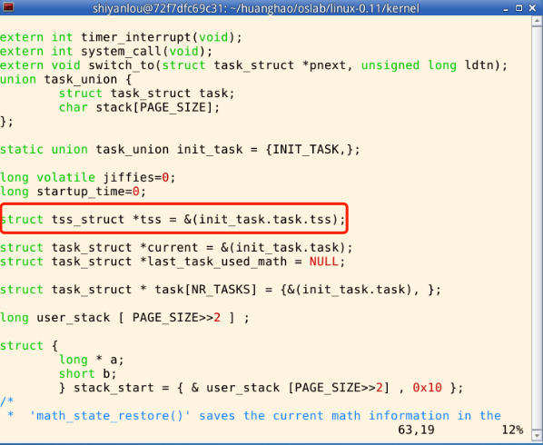
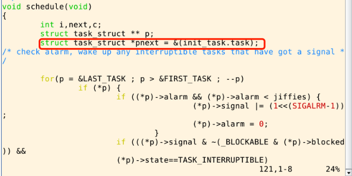
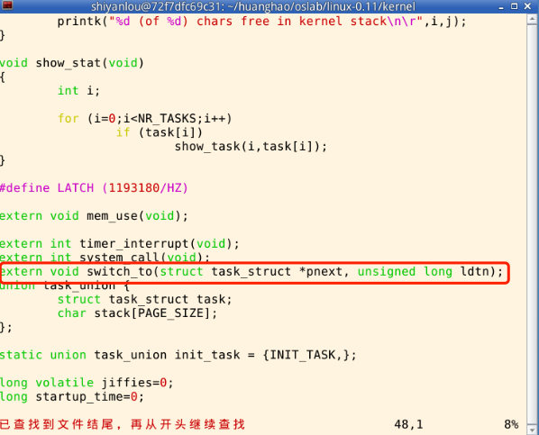
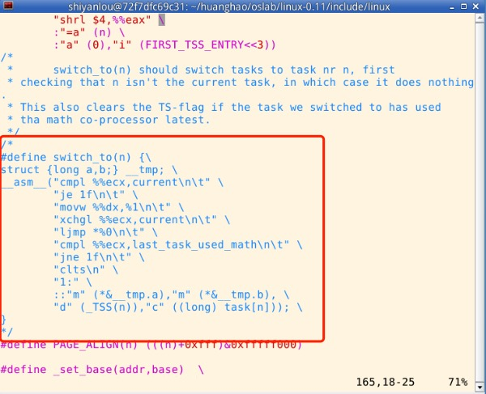
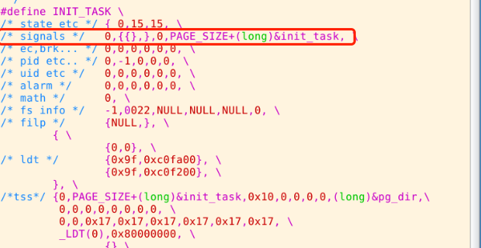

# 操作系统课程设计实验四


## 一、实验目的

+ 深入理解进程和进程切换的概念；
+ 综合应用进程、CPU管理、PCB、LDT、内核栈、内核态等知识解决实际问题；
+ 开始建立系统认识。

## 二、实验内容
    
参考实验楼教程 https://www.shiyanlou.com/courses/115/labs/571/document/

## 三、实验步骤

### 1、定义全局变量tss

路径：/linux-0.11/kernel/sched.c



### 2、修改schedule函数

路径：/linux-0.11/kernel/sched.c



### 3、增加switch_to函数的引用声明

路径：/linux-0.11/kernel/sched.c




### 4、注释掉switch_to函数

路径：/linux-0.11/include/linux/sched.h




### 5、在task_struct中增加kernelstack的定义，放着变量blocked后

路径：/linux-0.11/include/linux/sched.h


### 6、修改宏INIT_TASK

路径：/linux-0.11/include/linux/sched.h



### 7、在kernel/system_call.s中做修改

这个路径如上，修改比较麻烦，我直接贴代码了。有一些中文变成乱码了，但是都注释了，可以直接使用。需要对照原文件看一下哪地方不一样，然后直接粘上去就行，或者直接替换（不推荐）。

```
/*
 *  linux/kernel/system_call.s
 *
 *  (C) 1991  Linus Torvalds
 */

/*
 *  system_call.s  contains the system-call low-level handling routines.
 * This also contains the timer-interrupt handler, as some of the code is
 * the same. The hd- and flopppy-interrupts are also here.
 *
 * NOTE: This code handles signal-recognition, which happens every time
 * after a timer-interrupt and after each system call. Ordinary interrupts
 * don't handle signal-recognition, as that would clutter them up totally
 * unnecessarily.
 *
 * Stack layout in 'ret_from_system_call':
 *
 *	 0(%esp) - %eax
 *	 4(%esp) - %ebx
 *	 8(%esp) - %ecx
 *	 C(%esp) - %edx
 *	10(%esp) - %fs
 *	14(%esp) - %es
 *	18(%esp) - %ds
 *	1C(%esp) - %eip
 *	20(%esp) - %cs
 *	24(%esp) - %eflags
 *	28(%esp) - %oldesp
 *	2C(%esp) - %oldss
 */

SIG_CHLD	= 17

EAX		= 0x00
EBX		= 0x04
ECX		= 0x08
EDX		= 0x0C
FS		= 0x10
ES		= 0x14
DS		= 0x18
EIP		= 0x1C
CS		= 0x20
EFLAGS		= 0x24
OLDESP		= 0x28
OLDSS		= 0x2C

ESPO	=4

state	= 0		# these are offsets into the task-struct.
counter	= 4
priority = 8
signal	= 12
sigaction = 16		# MUST be 16 (=len of sigaction)
blocked = (33*16)
KERNEL_STACK	=(33*16+4)

# offsets within sigaction
sa_handler = 0
sa_mask = 4
sa_flags = 8
sa_restorer = 12

nr_system_calls = 72

/*
 * Ok, I get parallel printer interrupts while using the floppy for some
 * strange reason. Urgel. Now I just ignore them.
 */
.globl system_call,sys_fork,timer_interrupt,sys_execve,switch_to
.globl hd_interrupt,floppy_interrupt,parallel_interrupt
.globl device_not_available, coprocessor_error, first_return_from_kernel

.align 2
bad_sys_call:
	movl $-1,%eax
	iret
.align 2
reschedule:
	pushl $ret_from_sys_call
	jmp schedule
.align 2
system_call:
	cmpl $nr_system_calls-1,%eax
	ja bad_sys_call
	push %ds
	push %es
	push %fs
	pushl %edx
	pushl %ecx		# push %ebx,%ecx,%edx as parameters
	pushl %ebx		# to the system call
	movl $0x10,%edx		# set up ds,es to kernel space
	mov %dx,%ds
	mov %dx,%es
	movl $0x17,%edx		# fs points to local data space
	mov %dx,%fs
	call sys_call_table(,%eax,4)
	pushl %eax
	movl current,%eax
	cmpl $0,state(%eax)		# state
	jne reschedule
	cmpl $0,counter(%eax)		# counter
	je reschedule
ret_from_sys_call:
	movl current,%eax		# task[0] cannot have signals
	cmpl task,%eax
	je 3f
	cmpw $0x0f,CS(%esp)		# was old code segment supervisor ?
	jne 3f
	cmpw $0x17,OLDSS(%esp)		# was stack segment = 0x17 ?
	jne 3f
	movl signal(%eax),%ebx
	movl blocked(%eax),%ecx
	notl %ecx
	andl %ebx,%ecx
	bsfl %ecx,%ecx
	je 3f
	btrl %ecx,%ebx
	movl %ebx,signal(%eax)
	incl %ecx
	pushl %ecx
	call do_signal
	popl %eax
3:	popl %eax
	popl %ebx
	popl %ecx
	popl %edx
	pop %fs
	pop %es
	pop %ds
	iret

.align 2
coprocessor_error:
	push %ds
	push %es
	push %fs
	pushl %edx
	pushl %ecx
	pushl %ebx
	pushl %eax
	movl $0x10,%eax
	mov %ax,%ds
	mov %ax,%es
	movl $0x17,%eax
	mov %ax,%fs
	pushl $ret_from_sys_call
	jmp math_error

.align 2
device_not_available:
	push %ds
	push %es
	push %fs
	pushl %edx
	pushl %ecx
	pushl %ebx
	pushl %eax
	movl $0x10,%eax
	mov %ax,%ds
	mov %ax,%es
	movl $0x17,%eax
	mov %ax,%fs
	pushl $ret_from_sys_call
	clts				# clear TS so that we can use math
	movl %cr0,%eax
	testl $0x4,%eax			# EM (math emulation bit)
	je math_state_restore
	pushl %ebp
	pushl %esi
	pushl %edi
	call math_emulate
	popl %edi
	popl %esi
	popl %ebp
	ret

.align 2
timer_interrupt:
	push %ds		# save ds,es and put kernel data space
	push %es		# into them. %fs is used by _system_call
	push %fs
	pushl %edx		# we save %eax,%ecx,%edx as gcc doesn't
	pushl %ecx		# save those across function calls. %ebx
	pushl %ebx		# is saved as we use that in ret_sys_call
	pushl %eax
	movl $0x10,%eax
	mov %ax,%ds
	mov %ax,%es
	movl $0x17,%eax
	mov %ax,%fs
	incl jiffies
	movb $0x20,%al		# EOI to interrupt controller #1
	outb %al,$0x20
	movl CS(%esp),%eax
	andl $3,%eax		# %eax is CPL (0 or 3, 0=supervisor)
	pushl %eax
	call do_timer		# 'do_timer(long CPL)' does everything from
	addl $4,%esp		# task switching to accounting ...
	jmp ret_from_sys_call

.align 2
sys_execve:
	lea EIP(%esp),%eax
	pushl %eax
	call do_execve
	addl $4,%esp
	ret

.align 2
sys_fork:
	call find_empty_process
	testl %eax,%eax
	js 1f
	push %gs
	pushl %esi
	pushl %edi
	pushl %ebp
	pushl %eax
	call copy_process
	addl $20,%esp
1:	ret

hd_interrupt:
	pushl %eax
	pushl %ecx
	pushl %edx
	push %ds
	push %es
	push %fs
	movl $0x10,%eax
	mov %ax,%ds
	mov %ax,%es
	movl $0x17,%eax
	mov %ax,%fs
	movb $0x20,%al
	outb %al,$0xA0		# EOI to interrupt controller #1
	jmp 1f			# give port chance to breathe
1:	jmp 1f
1:	xorl %edx,%edx
	xchgl do_hd,%edx
	testl %edx,%edx
	jne 1f
	movl $unexpected_hd_interrupt,%edx
1:	outb %al,$0x20
	call *%edx		# "interesting" way of handling intr.
	pop %fs
	pop %es
	pop %ds
	popl %edx
	popl %ecx
	popl %eax
	iret

floppy_interrupt:
	pushl %eax
	pushl %ecx
	pushl %edx
	push %ds
	push %es
	push %fs
	movl $0x10,%eax
	mov %ax,%ds
	mov %ax,%es
	movl $0x17,%eax
	mov %ax,%fs
	movb $0x20,%al
	outb %al,$0x20		# EOI to interrupt controller #1
	xorl %eax,%eax
	xchgl do_floppy,%eax
	testl %eax,%eax
	jne 1f
	movl $unexpected_floppy_interrupt,%eax
1:	call *%eax		# "interesting" way of handling intr.
	pop %fs
	pop %es
	pop %ds
	popl %edx
	popl %ecx
	popl %eax
	iret

parallel_interrupt:
	pushl %eax
	movb $0x20,%al
	outb %al,$0x20
	popl %eax
	iret

.align 2 
switch_to: 
    pushl %ebp 
    movl %esp,%ebp        #????????C???? 
    pushfl            #??????eflags?????? 
    pushl %ecx 
    pushl %ebx 
    pushl %eax 
    movl 8(%ebp),%ebx    #??ebx??????????switch_to(pnext,LDT(next)) 
    cmpl %ebx,current    #????????PCB????????PCB 
    je 1f            #?????????? 
    #??PCB 
    movl %ebx,%eax        #ebx??????????????pcb 
    xchgl %eax,current    #??eax?current??????eax??????????PCB 
    #TSS???????? 
    movl tss,%ecx        #????tss?????ecx? 
    addl $4096,%ebx        #??tss???????????ebx? 
    movl %ebx,ESP0(%ecx)    #????????????tss???????esp0=4 
    #????? 
    movl %esp,KERNEL_STACK(%eax)    #?????PCB?????????? 
    movl $1f,KERNEL_EIP(%eax)    #?1??????????PCB?EIP????? 
    movl 8(%ebp),%ebx    #??ebx?? 
    movl KERNEL_STACK(%ebx),%esp    #????????????????? 
#???????????????????????
    pushl KERNEL_EIP(%ebx)        #???????PCB??EIP???????? 
    jmp  switch_csip        #??switch_csip??????? 
#    ???LDT??????
#    ???LDT?????? 
1:    popl %eax 
    popl %ebx 
    popl %ecx 
    popl %ebp 
#????????????????????????
# first_return_from_kernel?????fork.c????
    ret            

.align 2 
switch_to: 
    pushl %ebp 
    movl %esp,%ebp        #????????C???? 
    pushfl            #??????eflags?????? 
    pushl %ecx 
    pushl %ebx 
    pushl %eax 
    movl 8(%ebp),%ebx    #??ebx??????????switch_to(pnext,LDT(next)) 
    cmpl %ebx,current    #????????PCB????????PCB 
    je 1f            #?????????? 
    #??PCB 
    movl %ebx,%eax        #ebx??????????????pcb 
    xchgl %eax,current    #??eax?current??????eax??????????PCB 
    #TSS???????? 
    movl tss,%ecx        #????tss?????ecx? 
    addl $4096,%ebx        #??tss???????????ebx? 
    movl %ebx,ESP0(%ecx)    #????????????tss???????esp0=4 
    #????? 
    movl %esp,KERNEL_STACK(%eax)    #?????PCB?????????? 
    movl $1f,KERNEL_EIP(%eax)    #?1??????????PCB?EIP????? 
    movl 8(%ebp),%ebx    #??ebx?? 
    movl KERNEL_STACK(%ebx),%esp    #????????????????? 
#???????????????????????
    pushl KERNEL_EIP(%ebx)        #???????PCB??EIP???????? 
    jmp  switch_csip        #??switch_csip??????? 
#    ???LDT??????
#    ???LDT?????? 
1:    popl %eax 
    popl %ebx 
    popl %ecx 
    popl %ebp 
    ret       

.align 2
first_return_from_kernel:
    popl %edx
    popl %edi
    popl %esi
    pop  %gs
    pop  %fs
    pop  %es
    pop  %ds
    iret     
```

### 8、在kernel/fork.c中做修改

需要对照原文件看一下哪地方不一样，然后直接粘上去就行，或者直接替换（不推荐）。

```
/*
 *  linux/kernel/system_call.s
 *
 *  (C) 1991  Linus Torvalds
 */

/*
 *  system_call.s  contains the system-call low-level handling routines.
 * This also contains the timer-interrupt handler, as some of the code is
 * the same. The hd- and flopppy-interrupts are also here.
 *
 * NOTE: This code handles signal-recognition, which happens every time
 * after a timer-interrupt and after each system call. Ordinary interrupts
 * don't handle signal-recognition, as that would clutter them up totally
 * unnecessarily.
 *
 * Stack layout in 'ret_from_system_call':
 *
 *	 0(%esp) - %eax
 *	 4(%esp) - %ebx
 *	 8(%esp) - %ecx
 *	 C(%esp) - %edx
 *	10(%esp) - %fs
 *	14(%esp) - %es
 *	18(%esp) - %ds
 *	1C(%esp) - %eip
 *	20(%esp) - %cs
 *	24(%esp) - %eflags
 *	28(%esp) - %oldesp
 *	2C(%esp) - %oldss
 */

SIG_CHLD	= 17

EAX		= 0x00
EBX		= 0x04
ECX		= 0x08
EDX		= 0x0C
FS		= 0x10
ES		= 0x14
DS		= 0x18
EIP		= 0x1C
CS		= 0x20
EFLAGS		= 0x24
OLDESP		= 0x28
OLDSS		= 0x2C

ESPO	=4

state	= 0		# these are offsets into the task-struct.
counter	= 4
priority = 8
signal	= 12
sigaction = 16		# MUST be 16 (=len of sigaction)
blocked = (33*16)
KERNEL_STACK	=(33*16+4)

# offsets within sigaction
sa_handler = 0
sa_mask = 4
sa_flags = 8
sa_restorer = 12

nr_system_calls = 72

/*
 * Ok, I get parallel printer interrupts while using the floppy for some
 * strange reason. Urgel. Now I just ignore them.
 */
.globl system_call,sys_fork,timer_interrupt,sys_execve,switch_to
.globl hd_interrupt,floppy_interrupt,parallel_interrupt
.globl device_not_available, coprocessor_error, first_return_from_kernel

.align 2
bad_sys_call:
	movl $-1,%eax
	iret
.align 2
reschedule:
	pushl $ret_from_sys_call
	jmp schedule
.align 2
system_call:
	cmpl $nr_system_calls-1,%eax
	ja bad_sys_call
	push %ds
	push %es
	push %fs
	pushl %edx
	pushl %ecx		# push %ebx,%ecx,%edx as parameters
	pushl %ebx		# to the system call
	movl $0x10,%edx		# set up ds,es to kernel space
	mov %dx,%ds
	mov %dx,%es
	movl $0x17,%edx		# fs points to local data space
	mov %dx,%fs
	call sys_call_table(,%eax,4)
	pushl %eax
	movl current,%eax
	cmpl $0,state(%eax)		# state
	jne reschedule
	cmpl $0,counter(%eax)		# counter
	je reschedule
ret_from_sys_call:
	movl current,%eax		# task[0] cannot have signals
	cmpl task,%eax
	je 3f
	cmpw $0x0f,CS(%esp)		# was old code segment supervisor ?
	jne 3f
	cmpw $0x17,OLDSS(%esp)		# was stack segment = 0x17 ?
	jne 3f
	movl signal(%eax),%ebx
	movl blocked(%eax),%ecx
	notl %ecx
	andl %ebx,%ecx
	bsfl %ecx,%ecx
	je 3f
	btrl %ecx,%ebx
	movl %ebx,signal(%eax)
	incl %ecx
	pushl %ecx
	call do_signal
	popl %eax
3:	popl %eax
	popl %ebx
	popl %ecx
	popl %edx
	pop %fs
	pop %es
	pop %ds
	iret

.align 2
coprocessor_error:
	push %ds
	push %es
	push %fs
	pushl %edx
	pushl %ecx
	pushl %ebx
	pushl %eax
	movl $0x10,%eax
	mov %ax,%ds
	mov %ax,%es
	movl $0x17,%eax
	mov %ax,%fs
	pushl $ret_from_sys_call
	jmp math_error

.align 2
device_not_available:
	push %ds
	push %es
	push %fs
	pushl %edx
	pushl %ecx
	pushl %ebx
	pushl %eax
	movl $0x10,%eax
	mov %ax,%ds
	mov %ax,%es
	movl $0x17,%eax
	mov %ax,%fs
	pushl $ret_from_sys_call
	clts				# clear TS so that we can use math
	movl %cr0,%eax
	testl $0x4,%eax			# EM (math emulation bit)
	je math_state_restore
	pushl %ebp
	pushl %esi
	pushl %edi
	call math_emulate
	popl %edi
	popl %esi
	popl %ebp
	ret

.align 2
timer_interrupt:
	push %ds		# save ds,es and put kernel data space
	push %es		# into them. %fs is used by _system_call
	push %fs
	pushl %edx		# we save %eax,%ecx,%edx as gcc doesn't
	pushl %ecx		# save those across function calls. %ebx
	pushl %ebx		# is saved as we use that in ret_sys_call
	pushl %eax
	movl $0x10,%eax
	mov %ax,%ds
	mov %ax,%es
	movl $0x17,%eax
	mov %ax,%fs
	incl jiffies
	movb $0x20,%al		# EOI to interrupt controller #1
	outb %al,$0x20
	movl CS(%esp),%eax
	andl $3,%eax		# %eax is CPL (0 or 3, 0=supervisor)
	pushl %eax
	call do_timer		# 'do_timer(long CPL)' does everything from
	addl $4,%esp		# task switching to accounting ...
	jmp ret_from_sys_call

.align 2
sys_execve:
	lea EIP(%esp),%eax
	pushl %eax
	call do_execve
	addl $4,%esp
	ret

.align 2
sys_fork:
	call find_empty_process
	testl %eax,%eax
	js 1f
	push %gs
	pushl %esi
	pushl %edi
	pushl %ebp
	pushl %eax
	call copy_process
	addl $20,%esp
1:	ret

hd_interrupt:
	pushl %eax
	pushl %ecx
	pushl %edx
	push %ds
	push %es
	push %fs
	movl $0x10,%eax
	mov %ax,%ds
	mov %ax,%es
	movl $0x17,%eax
	mov %ax,%fs
	movb $0x20,%al
	outb %al,$0xA0		# EOI to interrupt controller #1
	jmp 1f			# give port chance to breathe
1:	jmp 1f
1:	xorl %edx,%edx
	xchgl do_hd,%edx
	testl %edx,%edx
	jne 1f
	movl $unexpected_hd_interrupt,%edx
1:	outb %al,$0x20
	call *%edx		# "interesting" way of handling intr.
	pop %fs
	pop %es
	pop %ds
	popl %edx
	popl %ecx
	popl %eax
	iret

floppy_interrupt:
	pushl %eax
	pushl %ecx
	pushl %edx
	push %ds
	push %es
	push %fs
	movl $0x10,%eax
	mov %ax,%ds
	mov %ax,%es
	movl $0x17,%eax
	mov %ax,%fs
	movb $0x20,%al
	outb %al,$0x20		# EOI to interrupt controller #1
	xorl %eax,%eax
	xchgl do_floppy,%eax
	testl %eax,%eax
	jne 1f
	movl $unexpected_floppy_interrupt,%eax
1:	call *%eax		# "interesting" way of handling intr.
	pop %fs
	pop %es
	pop %ds
	popl %edx
	popl %ecx
	popl %eax
	iret

parallel_interrupt:
	pushl %eax
	movb $0x20,%al
	outb %al,$0x20
	popl %eax
	iret

.align 2 
switch_to: 
    pushl %ebp 
    movl %esp,%ebp        #????????C???? 
    pushfl            #??????eflags?????? 
    pushl %ecx 
    pushl %ebx 
    pushl %eax 
    movl 8(%ebp),%ebx    #??ebx??????????switch_to(pnext,LDT(next)) 
    cmpl %ebx,current    #????????PCB????????PCB 
    je 1f            #?????????? 
    #??PCB 
    movl %ebx,%eax        #ebx??????????????pcb 
    xchgl %eax,current    #??eax?current??????eax??????????PCB 
    #TSS???????? 
    movl tss,%ecx        #????tss?????ecx? 
    addl $4096,%ebx        #??tss???????????ebx? 
    movl %ebx,ESP0(%ecx)    #????????????tss???????esp0=4 
    #????? 
    movl %esp,KERNEL_STACK(%eax)    #?????PCB?????????? 
    movl $1f,KERNEL_EIP(%eax)    #?1??????????PCB?EIP????? 
    movl 8(%ebp),%ebx    #??ebx?? 
    movl KERNEL_STACK(%ebx),%esp    #????????????????? 
#???????????????????????
    pushl KERNEL_EIP(%ebx)        #???????PCB??EIP???????? 
    jmp  switch_csip        #??switch_csip??????? 
#    ???LDT??????
#    ???LDT?????? 
1:    popl %eax 
    popl %ebx 
    popl %ecx 
    popl %ebp 
#????????????????????????
# first_return_from_kernel?????fork.c????
    ret            

.align 2 
switch_to: 
    pushl %ebp 
    movl %esp,%ebp        #????????C???? 
    pushfl            #??????eflags?????? 
    pushl %ecx 
    pushl %ebx 
    pushl %eax 
    movl 8(%ebp),%ebx    #??ebx??????????switch_to(pnext,LDT(next)) 
    cmpl %ebx,current    #????????PCB????????PCB 
    je 1f            #?????????? 
    #??PCB 
    movl %ebx,%eax        #ebx??????????????pcb 
    xchgl %eax,current    #??eax?current??????eax??????????PCB 
    #TSS???????? 
    movl tss,%ecx        #????tss?????ecx? 
    addl $4096,%ebx        #??tss???????????ebx? 
    movl %ebx,ESP0(%ecx)    #????????????tss???????esp0=4 
    #????? 
    movl %esp,KERNEL_STACK(%eax)    #?????PCB?????????? 
    movl $1f,KERNEL_EIP(%eax)    #?1??????????PCB?EIP????? 
    movl 8(%ebp),%ebx    #??ebx?? 
    movl KERNEL_STACK(%ebx),%esp    #????????????????? 
#???????????????????????
    pushl KERNEL_EIP(%ebx)        #???????PCB??EIP???????? 
    jmp  switch_csip        #??switch_csip??????? 
#    ???LDT??????
#    ???LDT?????? 
1:    popl %eax 
    popl %ebx 
    popl %ecx 
    popl %ebp 
    ret       

.align 2
first_return_from_kernel:
    popl %edx
    popl %edi
    popl %esi
    pop  %gs
    pop  %fs
    pop  %es
    pop  %ds
    iret     
```

### 9、编译运行linux 0.11

> 这个之前做过很多次了。

### 10、回答问题

(这个部分真的不太会，答案是搜索摘录的，最后附上了参考资料)

>一、
（1）为什么要加4096；
因为Linux 0.11进程的内核栈和该进程的PCB在同一页内存上（一块4KB大小的内存），其中PCB位于这页内存的低地址，栈则位于这页内存的高地址。一开始内核栈无内容，应指向内存页的最顶端。
（2）为什么没有设置tss中的ss0？
虽然不使用TSS进行任务切换了，但是Intel的这态中断处理机制还要保持，所以仍然需要有一个当前TSS，这个TSS就是我们定义的那个全局变量tss，即0号进程的tss，所有进程都共用这个tss，任务切换时不再发生变化，所有内核栈共用一个ss0段选择子，也就是同一套内核栈基地址和界限。所以不用重新设置ss，只需要对TSS中的内核栈指针进行重写

>二、（1）子进程第一次执行时，eax=？为什么要等于这个数？哪里的工作让eax等于这样一个数？
eax=0，在eax里存放的是fork调用后的返回值，为了与返回子进程pid的父进程区分开。通过*(--krnstack) = 0;把内核栈中的值设为0，然后通过switch_to返回前的pop来设置。
（2）这段代码中的ebx和ecx来自哪里，是什么含义，为什么要通过这些代码将其写到子进程的内核栈中？
ebx，ecx来自父进程，它们是为调用sys_fork传入的参数，与switch_to前的pop相对应，以便完成弹栈工作
（3）这段代码中的ebp来自哪里，是什么含义，为什么要做这样的设置？可以不设置吗？为什么？
来自sys_fork入栈的参数。猜测该值应该是int调用之前进程中的ebp，即进程的用户态的ebp，所以为保证进程在返回用户时能正确处理栈帧，这里要保证该值被正确传递。所以要在这里入栈。在程序切换后时会使用到。

>3 . 为什么要在切换完LDT之后要重新设置fs=0x17？而且为什么重设操作要出现在切换完LDT之后？出现在LDT之前又会怎么样？
把GDT表达0x17对应的那个表项的基地址和段限长放在fs的隐藏部分,所以下次用fs生产用户态的内存地址时,若fs没有改过,则不必再去查GDT表,而是直接利用fs的隐藏部分中的基地址和段限长来得到用户态的内存地址,提高了执行效率。
必须要等到切换完LDT之后，这样才能保证寄存器的隐藏部分是新的进程的段基址和段限长，如果在切换LDT之前重新设置fs=0x17，那么寄存器的隐藏部分将是之前被切换出去的进程的段基址和段限长，是错误的。


## 四、参考资料

https://www.shiyanlou.com/courses/reports/1318134/
<br>
https://blog.csdn.net/qq_41708792/article/details/89637248
<br>
https://blog.csdn.net/xubing716/article/details/53412647
<br>
https://www.cnblogs.com/XiangfeiAi/p/4758401.html

